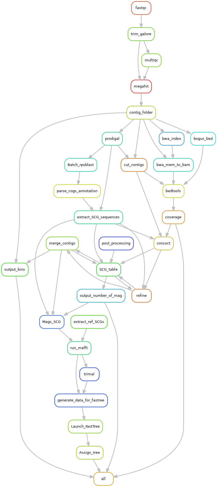

# Metahood
Metahood is a pipeline entirely based on snakemake, aimed at general analysis on metagenomic shrots reads. It allows to easily assemble, annotate and bin your samples.  

**What the  pipeline does :**
 - read quality check/trimming/filtering
- assemblies / co-assemblies
- binning (Concoct/Metabat2)
- consensus mags and mag coverage profiles
- diamond annotation and profiles
- taxonomic annotation of assembly, using kraken/CAT

 **What we want to add :**
 - conda install
 - other options for  binning, e.g. Graphbin
 - MAG post treatment:
	 - dereplication of mags over multiple assembly
	 - gtdbtk
	 - accurate coverage accross multiple assemblies  
 - extended domain of life characterisation
	 - viruses
	 - eukaryotes
 - extended annotation
	 - hmm based 
	 - cazym
 - figs for quick results overlook
	 - percent reads mapped/explained by mags....
	 - taxonomic profiles CAT/GTDB
	 - annotation on assembly graph


 **Overview of the rules workflows**
This graph represent the binning part of the workflow starting from sample trimming.


###  How to install Metahood:
We propose installation as the creation of a conda environment where all further call to Metahood will need to be carried out. 


An exhaustive list of all dependencies can be found at
[conda_env.yaml](https://github.com/Sebastien-Raguideau/Metahood/blob/master/Conda_envs/conda_env.yaml)
For speed up reason we strongly advice on using mamba instead of conda to solve the environment. To install mamba:

    conda install mamba -n base -c conda-forge

 
Creation of environment can be done following: 
```
cd path_to_repos/Metahood
mamba env create -f conda_envs/conda_env.yaml
```
You then need to activate the corresponding environment using : 

    conda activate MetaHood

**Fix CONCOCT install**
Unfortunately a bug still exist in the current conda package for concoct,  the following command fix an issue with pandas and an issue with a missing argument :
```
CPATH=`which concoct_refine`
sed -i 's/values/to_numpy/g' $CPATH
sed -i 's/as_matrix/to_numpy/g' $CPATH
sed -i 's/int(NK), args.seed, args.threads)/ int(NK), args.seed, args.threads, 500)/g' $CPATH
```
**Databases** We rely on Checkm hmm for MAG quality assesment:
Please download: `https://data.ace.uq.edu.au/public/CheckM_databases/checkm_data_2015_01_16.tar.gz`

##  How to run Metahood:

    conda activate MetaHood
    path_to_repos/Metahood/Metahood.py <config file> --cores <nb threads> -s <snakemake options> 


 ### Configuration file
 
The apparent lack of parameters is deceiving as all the complexity is hidden in a configuration file.  
[config.yaml](https://github.com/Sebastien-Raguideau/Metahood/blob/master/config.yaml)

This config file is in the yaml format and indentation is critical. Be mindful of indentation!


 ------ Resssources ------
  *  **threads** : Each task is allowed a maximum of 8 cores by default, you can change this value.

  *  **task_memory**: Some steps are using memory heavily, mainly rpsblast and bedtools. Quantity of ram allocated for theses, in Go. Default is 200Go, if you specify too high of a number Metahood runs only 1 such task at time. 
 IMPORTANT this will not limit the memory taken by rpsbalst of bedtool and just influence the number of tasks running at the same time.  

   * **Percent_memory**: Metahood, looks at availlable Ram and limit tasks constrained by task_memory. 

------ Output folder ------
  * **execution_directory** : Output folder, 
 
------ Path to data folder ------
  * **data**: Path to sample folders.
    * all samples are required to be stored in independant folders, the folder name will later define sample names in profiles. 
	- only paired reads
	- there must be a unique R1 file and R2 file
	- "R1" and "R2" must be in the filenames
	-  only following extensions : .fq, .fq.gz, .fastq, .fastq.gz, .fa, .fa.gz, .fasta, .fasta.gz 

------ Samples preprocessing ------
  * **filtering**: [OPTIONAL] path to .fasta database of sequences you want removed from your dataset, for instance human genomes.

------ Assembly parameters ------

  * **assembly**:
     * **parameters**: [OPTIONAL] any parameter you wish to pass to megahit
     * **per_sample**:  [OPTIONAL] specify which samples you want to assemble by themselves. You may specify a folder where to store these and also select the set of samples you want to have assembled, for instance : [per_sampleA|sampleA*] will create a per_sampleA directory inside the output directory and run a single sample assemblies on all samples folder starting with sampleA.
     * **groups**:  [OPTIONAL] specify a group of samples you want to have coassembled.
	     * **coassembly_folder_name**: ["regex"] where regex is a regular expression for selecting samples folders inside the data folder. Please note that the regex follow bash extended globing. If regex is "*", all samples will be selected for a coassembly 

**NOTE that if neither per_sample nor groups is informed, no task will be carried.**

 ------ Binning parameters------ 
  * **binning**:
	  * **concoct :**
		  * contig_size : [OPTIONAL] minimum size of contig used in binning,  default = 1000 base pairs
	  * **metabat2 :**
		  * contig_size : [OPTIONAL] minimum size of contig used in binning,  default = 1500 base pairs, can't be smaller than default

 ------ Annotation parameters ------ 
  * **annotation:**
	  * **diamond**: [OPTIONAL], diamond based annotation, under this, multiple named annotation can be defined
		  * **name_of_database** : arbitrary name used in filename output
			  * **db**: [path], path to database used by diamond
			  * **annotation**: [OPTIONAL], [path], path to tsv file, first column is gene name from diamond database, second column is a corresponding annotation name (KO entry, module, or anything really), further column will correspond to additional information you want the annotation output file to possess. For instance, reaction name, module .... etc  
			  * **filter**: [min_Bitscore , max_Evalue , min_Pid , min_subject_pid , min_coverage , min_Query_coverage], 
	  * **checkm**: [MANDATORY] path to downloaded checkm folder
	  *  **cat_db**: [OPTIONAL] path to cat database
	  *   **kraken_db:** [OPTIONAL] path to Kraken database
	  * **kofamscan:** [OPTIONAL] KEGG orthology annotation 
		  * **profile:** path to kofamscan profiles
		  * **ko_list:** path to kofamscan ko list 

##  Output Directory structure:
- **annotation**: this folder contain all annotation files and content will depend on config file:
	- contigs.faa: orfs in amino acid format
	- contigs.fna: orfs in nucleotides format
	- contigs.gff : orfs, gff definition
	- contigs.bed: simple bed file describing contigs length for bedtools coverage.
	- orfs.bed: bed file describing orfs regions on contigs for bedtools.
	- contigs_\<name_of_database\>_best_hits.tsv: best hit annotation from diamond database defined in config file
	- contigs_KEGG_best_hits.tsv: results from running kofamscan on the assembly.
	- 
- **assembly**: output directory of megahit
- **binning**: 
- **contigs**: contain contigs and index used by bwa mem for mapping
	- contigs.fa: contigs from megahit
	- contigs_C10k.fa: contigs splits at size 10k for running concoct 
- **map**: contain bam files from mapping samples to assembly as well as per sample contig and orfs coverage. All files are temporary and can be deleted in order to gain disc space.
		- \<sample\>_mapped_sorted.bam: bam file, sorted and filtered for mapped reads of sample 1 to assembly
		- \<sample\>.contigs.cov: mean depth of coverage per contig for sample \<sample\>.
		- \<sample\>.orf.cov: mean depth of coverage per orf for sample \<sample\>.
		- \<sample\>_contigs_C10K: mean depth of coverage per split contigs of size 10K, for running concoct. 
		- depth.txt: metabat2 coverage file
- **profile**:


##  Example Dataset:
Synthetic community as well as config file are available at :

    wget  http://seb.s3.climb.ac.uk/Synth_G45_S03D.tar.gz

After uncompressing, you'll find 2 config file example, one for coassembly, the other (SSA) for Single Sample Assembly.
In both you'll need to replace respectively "path_to_folder" by the location of uncompressed folder.

    Metahood.py --config <config file> --cores <nb threads> -s <snakemake options>


